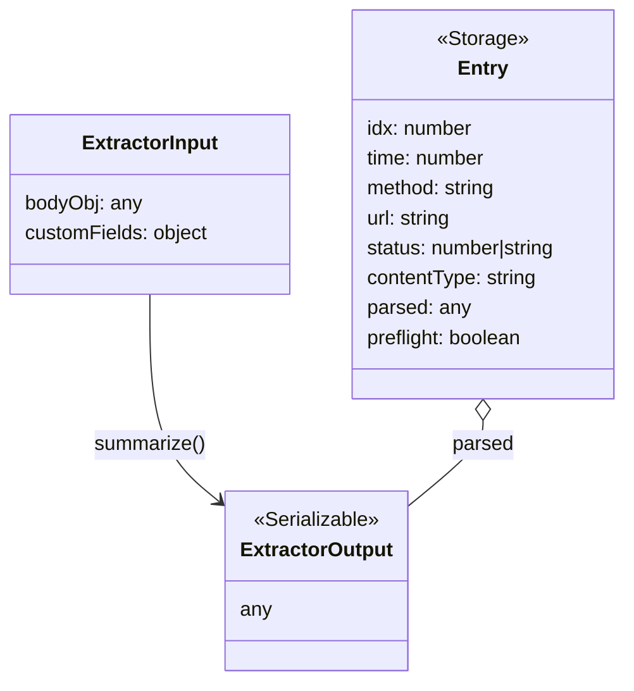

# Developer notes & data flow

This document explains how the Treasure Data Debugger extension captures and processes network traffic, the main data shapes you’ll see in code, where to add custom logic (extractors/redaction), and quick debugging tips.

## High-level flow

1. Browser loads a page and the extension is loaded into DevTools when the `panel.html` is opened.
2. `panel.js` registers a listener with `chrome.devtools.network.onRequestFinished` to receive network request/response events while the DevTools panel is open.
3. For each request event, the panel code:
   - filters requests by host suffixes (configurable `tdHosts` stored in `chrome.storage.sync`),
   - optionally hides CORS preflight requests (OPTIONS) unless `showPreflight` is enabled,
   - attempts to read request body (`postData`) or uses `req.getContent` for response body when needed,
   - determines `Content-Type` from request/response headers to choose parsing strategy,
   - hands the parsed body and context to the extractor pipeline (`parsers.js`) to produce a summarized payload,
   - applies redaction rules (built-in masks and user-provided regexes) when enabled,
   - renders a row in the panel UI table with parsed/sanitized data.

## Files of interest

- `extension/devtools.html` + `extension/devtools.js` — DevTools bootstrap that creates the panel.
- `extension/panel.html` — UI markup for the panel (controls, table, modals).
- `extension/panel.js` — main logic; preferences, network listener, parsing, rendering, import/export.
- `extension/parsers.js` — extractor definitions and the summarizer utilities.
- `extension/custom-extractors.js` — optional module for team-specific extractors (imported dynamically).
- `extension/background.js` — sets initial `chrome.storage.sync` defaults on install.
- `.github/workflows/ci.yml` — CI that runs the test suite.

## Key runtime data shapes

Requests are represented by the DevTools network event structure. `panel.js` reads or constructs the simplified internal shape used throughout the panel:

Entry stored in `state.entries` (one per captured request):

{
  idx: number,           // increasing capture index
  time: number,          // epoch ms when captured
  method: string,        // HTTP method
  url: string,           // full request URL
  status: number|string, // response status (if available)
  contentType: string,   // chosen content type from headers
  parsed: any,           // result from extractor.summarize (object/primitive)
  preflight: boolean     // true if OPTIONS preflight
}

Extractor input context (what extractors receive):

{
  bodyObj: any,         // parsed JSON or object derived from form/newline JSON
  customFields: object  // user-provided per-extractor config from chrome.storage
}

Extractor output: any serializable value. Built-in extractors return objects like:
- `td-events`: { event_count: N, sample: [ ... ] }
- `td-records`: { record_count: N, sample: [ ... ] }
- `td-record`: { record_count: 1, sample: [ ... ] }
- `generic`: summarized body object/value

Redaction rules are compiled from `chrome.storage.sync.redactionRules` (array of regex strings) and applied to string values in the parsed `parsed` object.

## Parsing strategies used

- JSON: when `Content-Type` is JSON-ish, parse with `JSON.parse` and feed to extractors.
- application/x-www-form-urlencoded: parsed into key/value pairs and JSON.parse attempted for values.
- newline-delimited JSON: tries first non-empty line as JSON.
- fallback: returns truncated string when content is plain text and not parseable.

The extractor pipeline is intentionally pluggable — `panel.js` builds a list of extractors starting with any custom ones (from `custom-extractors.js`) and falling back to `defaultExtractors` from `parsers.js`.

## Extension points — how to customize

1. Custom extractors
   - Add `extension/custom-extractors.js` exporting `default` or `extractors` array of extractor objects.
   - Each extractor shape:
     {
       name: 'my-extractor',
       match: ({ bodyObj, customFields }) => boolean,
       summarize: ({ bodyObj, customFields }) => any
     }
   - Keep extractors pure and defensive — catching exceptions in `match`/`summarize` prevents panel breaks.

2. Settings (customFields)
   - Users can open Settings in the panel and edit JSON for per-extractor rules (`keys`, `includeAll`, `sampleCount`, etc.).

3. Redaction rules
   - In the panel, go to Redaction Rules and add one JavaScript-style regex per line (no slashes). These are applied to all string values.

## Debugging tips

- Open DevTools and the TD Debugger panel before reloading target page — DevTools only streams events while the panel is open.
- Use `Show non-TD` to capture non-target traffic for diagnosing why a request isn’t being recognized.
- Toggle `Show preflights` to include OPTIONS requests when debugging CORS issues.
- Use `Settings -> includeAll` (in customFields for an extractor) to see all keys in payloads while exploring schema.
- Add console.logging to `panel.js`/`parsers.js` during development and reload the extension via `chrome://extensions`.

## Testing & CI pointers

- Unit tests live under `test/` and use Vitest. Run locally with `npm test`.
- CI (GitHub Actions) runs tests on push and PRs to `main`.

## Release notes and automation

- A release workflow (`.github/workflows/release.yml`) zips the `extension/` folder and attaches `td-debugger-mv3.zip` to a GitHub Release when you push a `v*` tag.
- For Chrome Web Store automatic publishing, add secrets and a step using a webstore upload action; this is optional and requires the CWS secrets noted in `README.md`.

## Small examples

- Example extractor matching TD events:

```js
// match
(ctx) => Array.isArray(ctx.bodyObj && ctx.bodyObj.events)

// summarize
(ctx) => ({ event_count: ctx.bodyObj.events.length, sample: ctx.bodyObj.events.slice(0,3) })
```

## Where to look to change behavior

- To change host detection: edit `panel.js` -> `isTDRequest` and the default `state.hosts` in `background.js`.
- To change how payloads are summarized: `parsers.js` (summarizer caps, keys, sample behavior).
- To change UI: `panel.html` + `styles.css` + `panel.js` rendering functions.

---

## Data flow diagram (Mermaid)

The following Mermaid flowchart shows the main runtime path: how requests are captured, parsed, summarized by extractors, redacted, and rendered. GitHub and many markdown viewers support Mermaid; you can also copy this block into https://mermaid.live to render it.

```mermaid
flowchart LR
  A[Browser page] --> B["DevTools open <br> (TD Debugger panel)"]
  B --> C["Network listener<br>chrome.devtools.network.onRequestFinished"]
  C --> D[Capture request event]
  D --> E{Is TD host?}
  E -- No --> F[Skip unless showNonTD]
  E -- Yes --> G["Read headers & body"]
  G --> H[Determine Content-Type]
  H --> I[Parse / normalize body]
  I --> J[Extractor pipeline]
  J --> J1["custom-extractors.js (optional)"]
  J --> J2["defaultExtractors (parsers.js)"]
  J2 --> K[Summarize payload]
  K --> L[Apply redaction rules]
  L --> M[Compose TD summary + URL info]
  M --> N[Save to state.entries]
  N --> O[Render row in UI table]
  O --> P[User actions: filter / export CSV / settings / import]
  Q[chrome.storage.sync] --> J
  Q --> L
  Q --> B

  style J1 fill:#f9f,stroke:#333,stroke-width:1px
  style J2 fill:#bbf,stroke:#333,stroke-width:1px
  style L fill:#ffd,stroke:#333,stroke-width:1px
```




### Data shapes (Mermaid)


