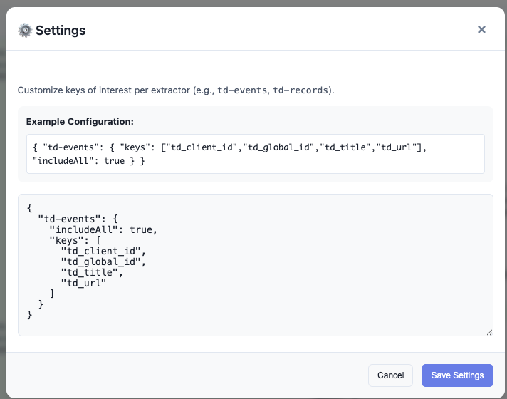
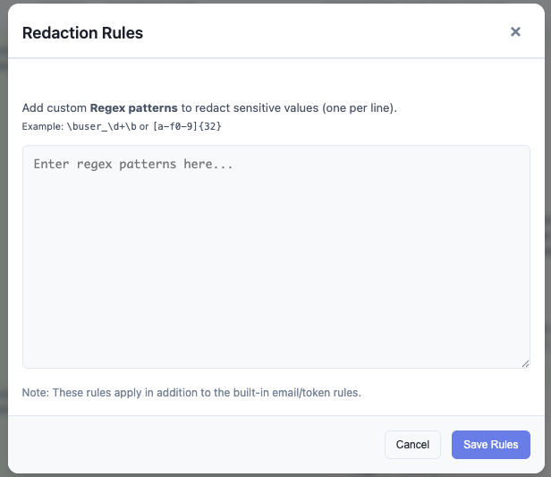

# Configuration Guide

Customize the Treasure Data Debugger to match your specific implementation and workflow.

## Settings Overview



Access settings by clicking the **Gear Icon** (⚙️) in the top right corner.

### General Settings

| Setting            | Description                                                        | Default            |
| ------------------ | ------------------------------------------------------------------ | ------------------ |
| **TD Hosts**       | Comma-separated list of domains to capture. Supports wildcards.    | `treasuredata.com` |
| **Show Non-TD**    | Capture requests that don't match TD Hosts (useful for debugging). | `Off`              |
| **Show Preflight** | Display CORS `OPTIONS` requests.                                   | `Off`              |
| **Dark Mode**      | Toggle between Light, Dark, or System theme.                       | `System`           |

---

## Custom Extractors

The extension uses "Extractors" to parse the raw request body into a readable format. While it comes with built-in extractors for standard TD SDKs, you can add custom ones.

### Extractor Logic

An extractor is a JavaScript object with two functions:

1. `match(request)`: Returns `true` if this extractor should handle the request.
2. `extract(request)`: Returns the parsed data object.

### Adding Custom Extractors

Edit the `extension/custom-extractors.js` file. This file is preserved during updates if you keep your local copy.

```javascript
// Example: Custom extractor for a proprietary wrapper
export const myCustomExtractor = {
  match: (req) => req.url.includes('/my-custom-endpoint'),
  extract: (req) => {
    const body = JSON.parse(req.postData);
    return {
      database: body.db_name,
      table: body.table_name,
      events: body.payload,
    };
  },
};
```

---

## Redaction Rules



Protect sensitive data by configuring redaction rules. These rules are applied to the "Parsed Payload" view.

### Managing Rules

1. Open **Settings**.
2. Click \*\*Manage### Custom Redaction Rules

You can add your own custom rules to redact specific data patterns.
**Note:** Rules are applied to the **values** of the parsed payload, not the raw JSON string.

**Format:**
Enter one Regular Expression (Regex) per line.

**Examples:**

1.  **Redact specific ID formats:**

    ```regex
    \buser_\d{5}\b
    ```

    Matches values like `user_12345`.

2.  **Redact internal project codes:**

    ```regex
    PROJ-[A-Z]{3}-\d{4}
    ```

    Matches values like `PROJ-ABC-2024`.

3.  **Redact specific tokens:**
    ```regex
    [a-f0-9]{32}
    ```
    Matches 32-character hex strings (common for MD5 hashes or tokens).

## Import / Export Settings

Share your configuration with your team.

- **Export Settings**: Downloads a `td-debugger-settings.json` file containing:
  - General preferences
  - Filter presets
  - Redaction rules
  - Custom field definitions

- **Import Settings**: Loads a settings file. This will merge with or overwrite existing settings based on the content.
