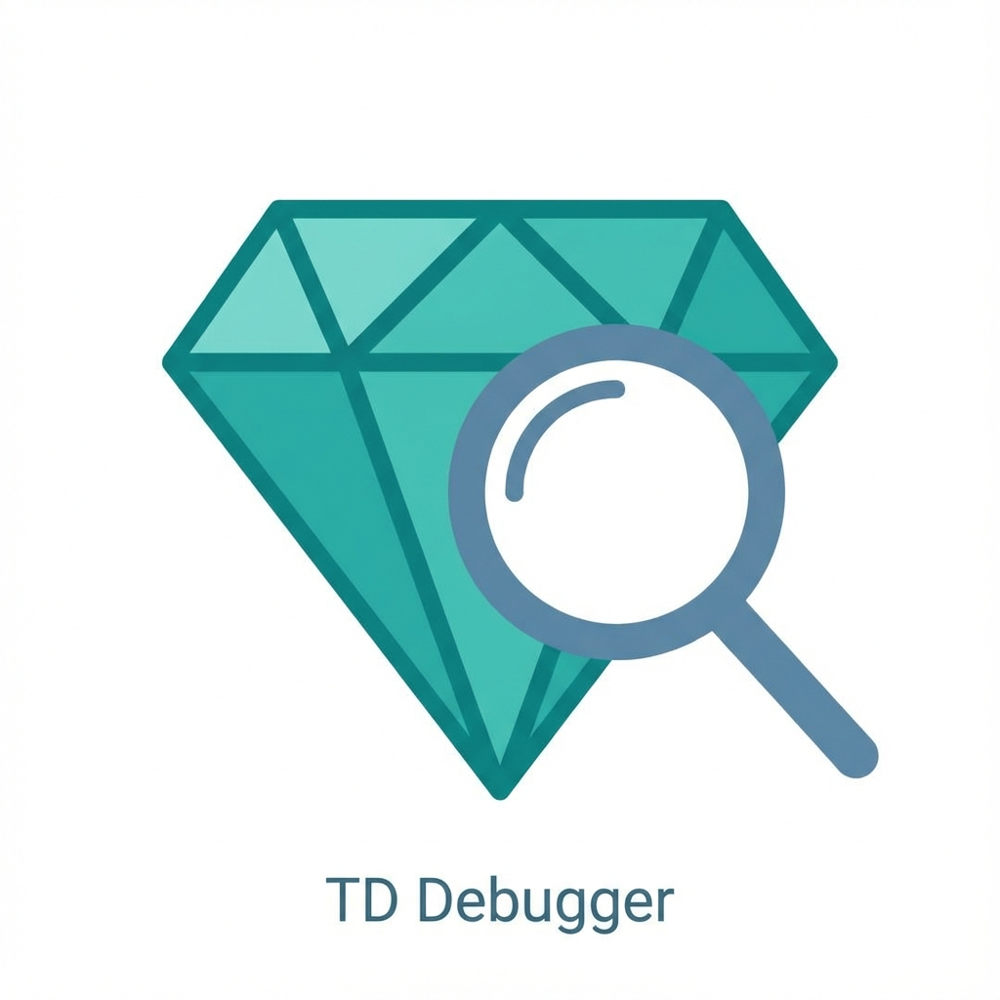
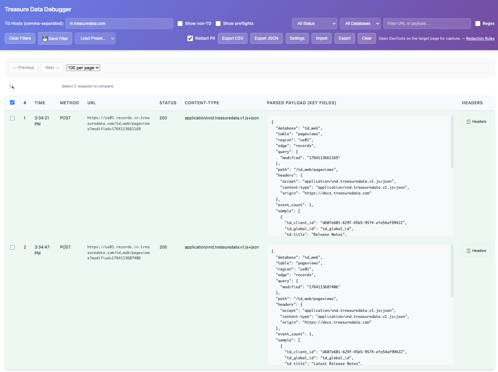

<div align="center">
  
  
  <h1>Treasure Data Debugger</h1>
  
  <p><strong>Modern Chrome DevTools Extension for Treasure Data Request Debugging</strong></p>

  <p>
    
    
    
  </p>
</div>

A powerful, privacy-first Chrome/Edge DevTools panel for inspecting and debugging Treasure Data browser SDK network calls. Built with Manifest V3, featuring advanced filtering, request comparison, real-time visualization, and a modern UI.

---

## ✨ Key Features



<div class="features-grid">
    <div class="feature-card">
        <span class="feature-icon">🔍</span>
        <h3>Advanced Request Capture</h3>
        <ul>
            <li>Automatic detection of Treasure Data requests</li>
            <li>Support for multiple TD regions and shards</li>
            <li>CORS preflight handling</li>
            <li>Non-TD request filtering</li>
        </ul>
    </div>
    <div class="feature-card">
        <span class="feature-icon">🎯</span>
        <h3>Smart Filtering</h3>
        <ul>
            <li>Text and regex search</li>
            <li>Status code filtering (2xx, 3xx, 4xx, 5xx)</li>
            <li>Database-specific filtering</li>
            <li>Saveable filter presets with sync</li>
        </ul>
    </div>
    <div class="feature-card">
        <span class="feature-icon">🔄</span>
        <h3>Request Comparison</h3>
        <ul>
            <li>Side-by-side request comparison</li>
            <li>Automatic difference detection</li>
            <li>Headers and payload comparison</li>
            <li>Visual diff indicators</li>
        </ul>
    </div>
    <div class="feature-card">
        <span class="feature-icon">📊</span>
        <h3>Data Export</h3>
        <ul>
            <li>CSV export for analysis</li>
            <li>JSON export for processing</li>
            <li>Filtered export support</li>
            <li>Batch operations</li>
        </ul>
    </div>
    <div class="feature-card">
        <span class="feature-icon">🔒</span>
        <h3>Privacy & Security</h3>
        <ul>
            <li>100% local processing</li>
            <li>No telemetry or tracking</li>
            <li>Authorization header masking</li>
            <li>PII redaction (built-in + custom rules)</li>
        </ul>
    </div>
    <div class="feature-card">
        <span class="feature-icon">⚡</span>
        <h3>Performance</h3>
        <ul>
            <li>Pagination for large datasets</li>
            <li>Optimized rendering</li>
            <li>Efficient filtering</li>
            <li>Minimal memory footprint</li>
        </ul>
    </div>
</div>

---

## 🚀 Quick Start

### Installation

1. Download or clone this repository
2. Open Chrome/Edge and navigate to `chrome://extensions`
3. Enable **Developer mode**
4. Click **Load unpacked** and select the `extension/` folder
5. Open DevTools on your site → switch to **TD Debugger** tab

### First Capture

1. Configure **TD Hosts** (e.g., `treasuredata.com`)
2. Reload your page with DevTools open
3. Watch requests appear in the table
4. Use filters to find specific requests
5. Click **Headers** or **Compare** for detailed analysis

[**→ Full Getting Started Guide**](getting-started.md)

---

## 📚 Documentation

- [**Getting Started**](getting-started.md) - Complete installation and setup guide
- [**Features**](features.md) - Comprehensive feature documentation
- [**Configuration**](configuration.md) - Settings and customization
- [**Development**](development.md) - Contributing and development guide
- [**API Reference**](api.md) - Custom extractor API
- [**Troubleshooting**](troubleshooting.md) - Common issues and solutions

---

## 🎨 Modern UI

The extension features a contemporary design with:

- Dark theme support (auto-detect system preference)
- Gradient headers and glassmorphic effects
- Smooth animations and transitions
- Color-coded status badges
- Responsive layout

---

## 🤝 Contributing

We welcome contributions! See our [Contributing Guide](../CONTRIBUTING.md) for details.

### Development Setup

```bash
# Clone the repository
git clone https://github.com/anilkulkarni87/treasuredata-debugger.git

# Install dependencies
npm install

# Run tests
npm test

# Run linter
npm run lint
```

---

## 📄 License

MIT © 2025

---

## 🔗 Links

- [GitHub Repository](https://github.com/anilkulkarni87/treasuredata-debugger)
- [Issue Tracker](https://github.com/anilkulkarni87/treasuredata-debugger/issues)
- [Changelog](../CHANGELOG.md)
- [Security Policy](../SECURITY.md)
